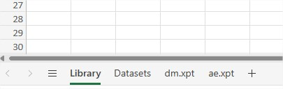
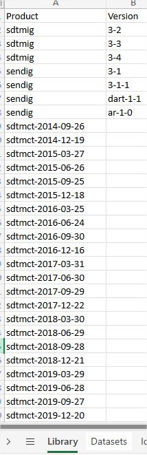
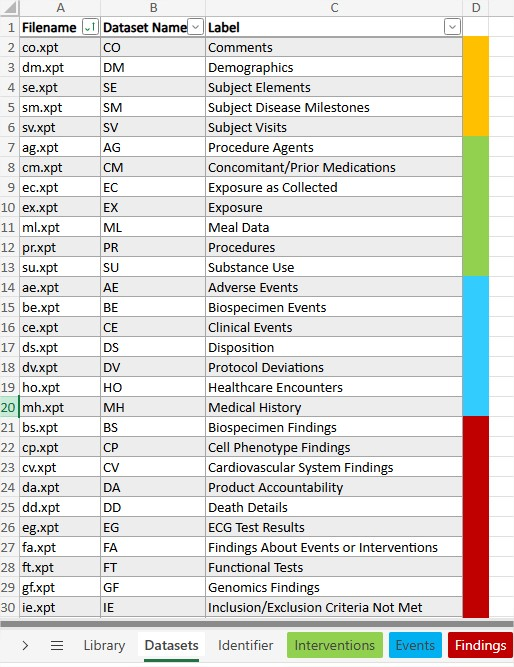
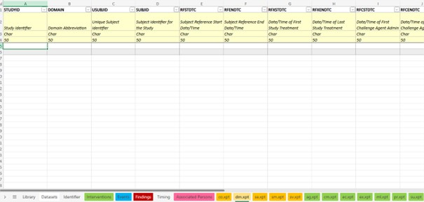
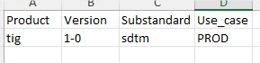
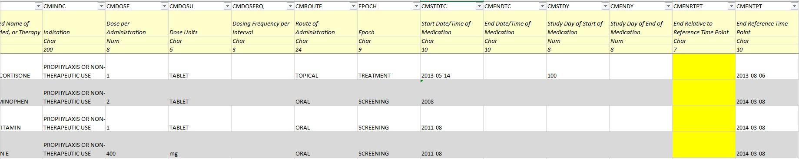
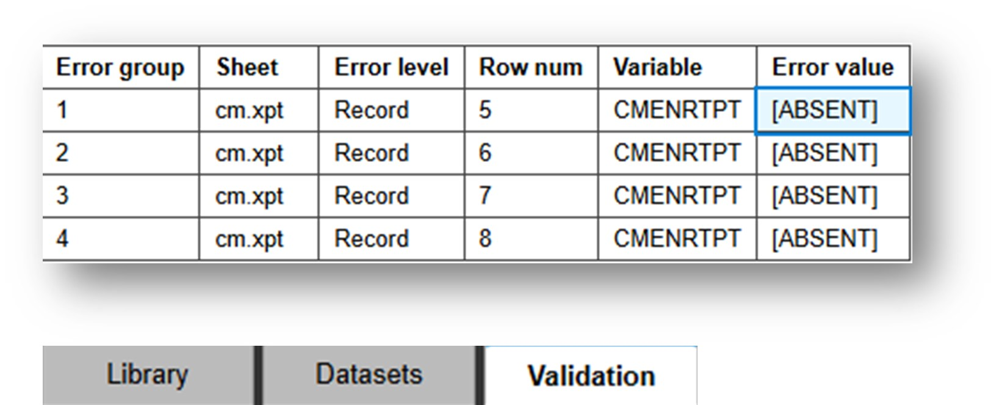

# Test Data

## Preparing Test Data for Unit Testing

### Assumptions

- CORE MVP 1.0 must support SAS V5 XPT and Dataset-JSON data file formats for validation. Other formats such as CSV, Dataset-XML, etc. are a nice-to-haves.
- Many volunteer contributors do not have the ability to create SAS V5 XPT files, easily and quickly for creation of test data for unit testing.
- An Excel format approach is very similar to creating data examples in the wiki.
- A well-templated Excel adds consistency and reduces fatigue.
- Test data in Excel are to be used for unit testing = checking whether the rule logic works correctly and output matches with what is expected.
- Volunteer contributors could also use unit testing for debugging rule logic.

- Unit testing includes testing rule logic on both positive and negative test data.
    - Positive test data: Test data is in compliance with the conformance rule and will not result in output. All test data passes.
    - Negative test data: Test data is not in compliance with the conformance rule and will result in output. Not all test data passes.
- Unit testing will be conducted per CDISC Open Rule. If more than one conformance rule (e.g. conformance rules from 2 different standards like SDTMIG and SENDIG use exactly the same rule logic and scope) is included in 1 CDISC Open Rule, then unit testing should only be done once. The standard used to create test data can be chosen by the volunteer contributor.
- Test data should be kept relatively small, just enough data points to assert correctness and full functionality of the rule.
- Existing mock studies in are available to the volunteer contributors as a valuable resource
- Volunteer contributors will receive a report (= results file) for each run of unit testing.

### Not Covered

This Test Data section does not cover unit test execution.

### Test Data Format

- Volunteer contributors will use Excel workbooks to create test data, such that there will be:
  - At least one file for positive test data.
  - At least one file for negative test data.
  - Positive and negative test data will be created in separate Excel workbooks.
- Multiple domains can be added in 1 Excel workbook.
- Because we want to simulate SAS V5 XPT, the Excel workbook contain different worksheets.
- Test Data templates are available and will ensure consistency in test data creation among the volunteer contributors but also help them in generating test data in the most efficient way.

#### SDTMIG & SENDIG

**Worksheets:**
  - A worksheet for library details, called '**Library**' where 'Product' and 'Version' need to be defined (e.g. Product = sdtmig, Version = 3-4)
  - A worksheet for Dataset metadata, called '**Datasets**' where 'Filename' and 'Label' need to be defined.
  - One worksheet **for each dataset** needed for the unit testing, with both variable metadata and data (e.g. ae.xpt for AE dataset, dm.xpt for DM dataset,...).

  

**Worksheet Completion based on Template:**
To ensure consistency and reduce fatigue, the templates are already prepopulated with standard data that can be adapted based on the need per rule. Adaptations should be done to only serve the rule testing purpose. All additional domains, worksheets,... should be removed.

- **Library**:
  - The Library worksheet will contain a list of different IGs (name and version) and also CDISC controlled terminology versions (e.g. sdtmct-2024-03-29)
  - Based on the rule that is going to be tested and the IG scope, the applicable 'product' and 'version' should be completed. Example: CG0100 is applicable for SDTMIG 3.3 so Product= sdtmig and Version = 3-3
  - If a rule is applicable for multiple versions of an IG, then only 1 IG should be tested unless there is a clear distinction in rule logic between IG versions.
  - If a rule needs to use CDISC CT, then also the CT version needs to be specified in a new record under 'Product'.

  

- **Datasets** 
  - The Dataset worksheet will contain all domains modeled in the included IGs
    - Dataset filename (e.g., ae.xpt)
    - Dataset label (e.g., Adverse Events)
  - Based on the rule that is going to be tested and the scope (Class, Domain), the dataset filename and dataset label of the domains that are used to perform the unit testing (= test data created), need to be completed in the Datasets worksheet. If AE is used to test the rule logic, then ae.xpt should be specified in the Datasets worksheet. All datasets that are created should be specified.
  - This worksheet should not list datasets that are not created.
  
  

- **\*.xpt**
  - There will be one worksheet per domain, fitted with:
    - Variable name (e.g., AETERM)
    - Variable label (e.g., Reported Term for the Adverse Event)
    - Data type (i.e., Char or Num)
    - Default variable length (i.e., 50 for Char, 8 for Num)
  - The templates also include additional data for further customization.
    - A list of Identifiers and Timing variables from SDTM v2.0.
    - A list of Events, Interventions, and Findings class variables from SDTM v2.0.

  

  #### ADaMIG
  
  under construction

  #### Define-XML
  
  - In case a CDISC Open Rule is using metadata captured in a define.xml to execute rule logic, then a test define.xml needs to be created (negative and positive) and uploaded for unit testing.
  - To create this test define.xml, the templates created for the Metadata Submission Guidelines for SDTM and ADaM can be used and adapted accordingly.
  
  #### TIG

  - Test data creation for TIG is similar to creation of test data for SDTMIG, SENDIG or ADaMIG.
  - There are 2 additional parameters in the library worksheet that need to be specified for TIG.
    - Substandard: sdtm, send, adam
    - Use_Case: PROD, INDH, NONCLIN, ANALYSIS
  - The applicability of these 2 parameters is indicated in the TIG conformance rules spreadsheet published on the CDISC website: https://www.cdisc.org/system/files/members/standard/foundational/TIG%20Conformance%20Rules%20v1.0%20%281%29.xlsx

  

  #### USDM

  under construction

### Creating Correct Test Data

**Best Practices**

Creating solid, qualitative test data is a skill on its own and needs to be done with care. Below best practices will help you during this process.
- Test data should test **all** functionalities of the rule logic.
- Test data should test both **condition** (if appplicable) and **rule**.
- If more than 1 domain is in scope, test data should be created for more than 1 domain.
  - Scope = EVENTS, then for example test data can be made for AE and MH.
  - Scope = ALL then for example test data for 1 EVENTS domain and 1 FINDINGS domain can be made.
  - If a domain is excluded from the scope, then this domain should be included in the test data as positive test data.
- Generating too many rows in test data should be avoided. Only what is necessary to test the rule logic should be created.
- If the rule logic is testing >, = , < or something similar, then test data should be created that is testing the treshold values.
- Positive test data should not generate output in unit testing.
- Negative test data should generate output in unit testing.

- If the rule that is being testing is referencing CDISC CT, then the correct name and version should be added under 'Product' in the 'Library' worksheet.

- Volunteer contributors should use the information available to create the test data, such that:
  - A test dataset can be a copied from a templated worksheet.
  - Worksheet can be renamed to match the dataset metadata.
  - Test data can be inserted as data rows to the copied worksheet.
  - Unused variables can be removed.
  - Variable metadata can be modified in accordance to test purpose of the associated rule logic.
  - Dataset metadata can be modified in accordance to test purpose of the associated rule logic.
  - Mock study data will be available to volunteer contributors to easily borrow (i.e., copy and paste) as test data.

- The Test Data Files should follow the naming conventions.
  - Positive Test Data
    - unit-test-<ruleid>-positive1.xlsx
    - unit-test-<ruleid>-positive2.xlsx (only if applicable)
    - ...
  - Negative Test Data
    - unit-test-<ruleid>-negative1.xlsx
    - unit-test-<ruleid>-negative2.xlsx (only if applicable)
    - ...

  - Examples
    - unit-test-CG0288-positive1.xlsx
    - unit-test-CG0288-negative1.xlsx

### Adding Predefined Discrepancies
- Prior to unit testing, expected output should be marked in the negative test data file. Cells expected to generate output should be highlighted in 'yellow'.
- In addition to the highlights, an additional validation sheet should be completed to list the expected output so that during unit testing this can be compared automatically with the output of the unit testing.
- Completion of the **Validation** worksheet.
  - **Error Group**:
    - Add each error as a new validation group (note that this might not be only a single row - for example if you highlight two cells that will cause a single error, and be outputted as a single error, then you should create TWO rows in the same validation group (ie both in group '1')).
    - Create groups using sequential numbers for the validation group column.
  - **Sheet**: Name of the data sheet with the error e.g. cm.xpt
  - **Error Level**:
    - Add 'Record' if it is a normal row error
    - 'Variable' if it is an error related to an entire column,
    - 'Dataset' if it is an error related to a whole dataset (ie missing ae.xpt sheet or similar).
  - **Row num**: Provide the row number (Note that any variable names will be row 1 and the first row starts from row 5 due to the metadata rows in the sheets).
  - **Variable**: Provide the variable name (found in the first row of the column) - with the row number this fully identifies the error cell.
  - **Error Value**:
    - Copy the error value from the highlighted cell into the 'Error value'.
    - If the highlighted cell has no value, use '[ABSENT]' to indicate this (including the square brackets).

### Templates - Examples - Sample Data

This section contains links to the different Test Data Templates, Test Data Examples and Sample Data. Together with the instructions given above, this should give the volunteer contributors sufficient information to create consistent, qualitative test data that should ensure correct unit testing of the rule.

  #### Template ####

  - The Dataset worksheet contains a list of datasets can be used for unit testing.
  - The Identifier, Events, Interventions, Findings, Timing, and Associated Persons worksheets are variables from SDTM v2.0.
  - The \*.xpt worksheets contain domain metadata from SDTMIG v3.4, as well as AC, APRELSUB, DI, and TX from SDTM v2.0.

  [unit-test-sdtmig-sendig-template.xlsx](files/unit-test-sdtmig-sendig-template.xlsx ":ignore")

  #### Examples ####

  Also, here is a mock Excel workbook for positive and negative testing against which contains:

  - dm.xpt and ae.xpt.
  - Both with variable metadata adjusted, unused columns removed, data rows added.

  [unit-test-ruleid-sdtmigexample-positive.xlsx](files/unit-test-sdtmigexample-positive.xlsx ":ignore")
  [unit-test-ruleid-sdtmigexample-negative.xlsx](files/unit-test-sdtmigexample-negative.xlsx ":ignore")

  #### Sample Data ####

  CDISC has 2 sets of mock study in SDTM format. They have been converted into Excel format, which can be tailored for unit test data.

  - [CDISCTestData-sdtm-xpt-xlsx.zip](files/CDISCTestData-sdtm-xpt-xlsx.zip ":ignore") A set of test data files transformed from the CDISCTestData Github repo, sourced from /SDTM/XPT. Per Read  Me, this mock study implements "SDTM IG Version 3.2.
  - [sdtm-msg-2-0-m5-datasets-xlsx.zip](files/sdtm-msg-2-0-m5-datasets-xlsx.zip ":ignore") A set of test data files transformed from the example submission bundled in the SDTM MSG v2.0, sourced from /m5/datasets/cdiscpilot01/tabulations/sdtm, as well as the split subdirectory. Per documentation, this example submission implements "SDTM v1.7/SDTMIG v3.3, and SDTM Terminology 2020-03-27.

## Storage

### Assumptions

- 1500 is an estimate of # of rules volunteer contributors will create.
- Each rule will have file artifacts, such as SAS, Excel, and XML files.
- Main purpose for these file artifacts is to support unit testing. Secondary purpose is to support regression test.
- Unit testing will need both data for positive test & negative test, which each volunteer contributors is responsible to create & maintain.
- Each test may require 1:n files.
- Each rule may require 1:n positive & negative tests.
- Each test run will have a validate report as a result, which each rule author is responsible to save.
- Conceptually, this requires some deep folder structure, e.g., [Rule Id] > Unit Test > Positive > [#] > files

### Proposal

GitHub will be used for storage:

- Supports drag-and-drops.
- File versioning is a built-in functionality, behind the scene, without user interventions.
- Test data storage is directly linked to the rule YAML file and the results file generated via automated unit testing, allowing clear traceability and version control.

### Sharepoint Site

SharePoint will be used to store the source data catalogs, templates etc. for volunteer contributors to use whenever needed.

[CORE Rules SharePoint (permission required)](https://cdisc.sharepoint.com/sites/CORERules/Shared%20Documents/Forms/AllItems.aspx)

### Local OneDrive Access

It is recommended that you use OneDrive for access to the CORE Rules SharePoint. This will allow you the ability to consult files on your local desktop without the need to upload or edit within the browser.

There are two options for accessing the Sharepoint files from OneDrive. The choice is personal preference, but Sharepoint allows you to only do one or the other.

- [Sync Sharepoint site](https://support.microsoft.com/en-us/office/sync-sharepoint-files-and-folders-87a96948-4dd7-43e4-aca1-53f3e18bea9b)
- [Add shortcut to OneDrive](https://support.microsoft.com/en-us/office/add-shortcuts-to-shared-folders-in-onedrive-for-work-or-school-d66b1347-99b7-4470-9360-ffc048d35a33)
